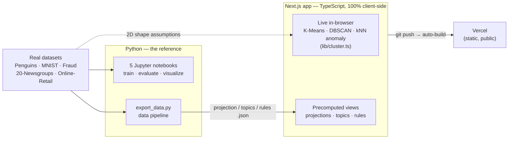

# Dive Deeper into Unsupervised Learning

> A hands-on tour of every major family of **label-free machine learning** — five from-first-principles
> notebooks on real datasets, plus a live browser playground.

[](https://dive-deeper-unsupervised-learning.vercel.app)
[](LICENSE)


### ▶ Live demo → **[dive-deeper-unsupervised-learning.vercel.app](https://dive-deeper-unsupervised-learning.vercel.app)**

---

## Recruiter TL;DR

- **What it is:** five self-contained notebooks covering the whole unsupervised-ML toolkit — clustering,
  dimensionality reduction, anomaly detection, topic modeling, and association rules — each on a *real*
  dataset, plus a deployed Next.js app where five of the ideas run live in the browser.
- **Hardest problem solved:** making label-free results *honest and verifiable* — validating clusters against
  true penguin species (ARI 0.80), scoring anomaly detectors on genuinely imbalanced fraud (0.17%) with
  PR-AUC, and shipping heavy Python-trained models to a zero-backend web app as precomputed data.
- **Concrete results:** K-Means recovers 3 penguin species at **ARI 0.80 / 91.9% match**; on real credit-card
  fraud, novelty-LOF hits **0.81 PR-AUC** (vs. 0.57 for the Gaussian baseline); the top mined shopping rule
  (*6 skull paper cups → 6 skull paper plates*) has **lift 14.3×**. All five notebooks execute top-to-bottom
  with zero errors; the web app ships at ~106 kB first-load with passing unit tests.

---

## Overview

Most ML tutorials teach *supervised* learning — predict a known label. This project is the other half:
**finding structure in data that has no labels at all.** There's no right answer to memorize; the algorithm
has to discover the groups, the shape, the outliers, or the themes on its own.

It's built for two audiences at once: a **beginner** who wants the *why* behind each method (every section
opens in plain English with an analogy before any code), and a **practitioner** who wants a clean, correct
reference. Every visualization has a dedicated *"How to Read This Chart"* walkthrough, and — unusually — the
notebooks are **honest about failure**: when silhouette prefers 2 clusters but the truth is 3, it says so and
explains why; when a Gaussian anomaly detector loses to Isolation Forest, it shows the assumption breaking.

Built as a portfolio piece to demonstrate end-to-end ML competency — from correct algorithm implementation and
honest evaluation through to a deployed, tested full-stack application.

---

## The Notebooks

| # | Notebook | What It Covers | Dataset(s) |
|---|----------|----------------|------------|
| 01 | [Clustering](01_clustering.ipynb) | K-Means (++/`n_init`/elbow/silhouette), Mini-Batch, DBSCAN, Agglomerative + dendrograms, GMM + BIC, internal metrics, and **external validation** (ARI/NMI vs. ground truth) | Palmer Penguins, 2D synthetic |
| 02 | [Dimensionality Reduction](02_dimensionality_reduction.ipynb) | PCA, Incremental PCA, scree plots, t-SNE (perplexity), UMAP, a PyTorch **autoencoder**, plus **NMF, Kernel PCA, and ICA** | MNIST (784-dim) |
| 03 | [Anomaly Detection](03_anomaly_detection.ipynb) | Isolation Forest, LOF, One-Class SVM, autoencoder reconstruction error, **Elliptic Envelope**, **novelty-mode LOF**, PR curves, threshold selection | Credit Card Fraud |
| 04 | [Topic Modeling](04_topic_modeling.ipynb) | **LDA** (coherence, pyLDAvis), **NMF** and **LSA** topic models, and **BERTopic** (transformer embeddings + HDBSCAN), head-to-head | 20 Newsgroups |
| 05 | [Association Rules](05_association_rules.ipynb) | **Apriori** and **FP-Growth**, frequent itemsets, support / confidence / **lift**, reading a rule as a business decision | Online Retail |

The arc: **group the rows** (01) → **compress the columns** (02) → **flag the rare** (03) → **find themes in
text** (04) → **find what co-occurs** (05). Five different questions, all answered without a single label.

---

## Architecture

Two design decisions drive the shape of this repo:

1. **Notebooks are the source of truth; the web app is a curated highlight reel.** The notebooks are the
   exhaustive reference (every algorithm, every chart). The playground shows the *headline* model per family —
   cramming ten clustering algorithms into a browser demo would add clutter and load time for no teaching gain.
2. **Split rendering by cost.** Cheap algorithms (K-Means / DBSCAN / kNN scoring on ≤300 points) are
   **re-implemented in TypeScript and run live in the browser** — instant, interactive, no server. Expensive
   ones (t-SNE on 900×784, LDA, Apriori over 540k transactions) are **precomputed in Python** and shipped as
   small static JSON. This keeps the app fully client-side (no backend, no cost, nothing leaves the user's
   machine) while still showing real results on real data.



---

## Tech Stack

| Layer | Tools | Why |
|-------|-------|-----|
| ML / data | scikit-learn 1.8, PyTorch, UMAP, gensim, BERTopic, mlxtend, pandas, NumPy | The standard unsupervised-ML stack; each notebook uses the canonical library for its family |
| Notebooks | Jupyter, nbconvert | Executed end-to-end via `nbconvert` so outputs are real, not hand-edited |
| Web | Next.js 15, React 19, TypeScript 5.7 | Static export, zero runtime dependencies beyond React — the whole app is client-side |
| Testing | Vitest | Unit tests for the hand-written in-browser algorithms |
| Hosting | Vercel | Git-connected auto-deploy of the static site |

---

## Skills Demonstrated

- **Unsupervised machine learning** — clustering, dimensionality reduction, anomaly detection, topic modeling,
  and association-rule mining, implemented and evaluated end-to-end.
- **Model evaluation & honest analysis** — external validation (ARI/NMI), PR-AUC on imbalanced data, coherence
  scoring, and explicit discussion of where each method fails.
- **Full-stack development** — a production Next.js/React/TypeScript app backed by a Python ML/data layer.
- **Data engineering / ETL** — a reproducible pipeline (`export_data.py`) turning raw datasets into
  model-ready precomputed artifacts.
- **Client-side ML inference** — K-Means, DBSCAN, and kNN scoring re-implemented in TypeScript to run live in
  the browser with no backend.
- **System design & tradeoff reasoning** — a documented split-rendering architecture (live vs. precomputed).
- **Automated testing** — Vitest unit tests on the algorithm implementations.
- **Cloud deployment** — public, git-auto-deployed static site on Vercel.
- **Data visualization** — canvas-based interactive scatter/topic/rule views with a "how to read this" layer.

---

## The Datasets

| Dataset | Task | Why it's used |
|---------|------|---------------|
| **[Palmer Penguins](https://allisonhorst.github.io/palmerpenguins/)** (333 rows) | Clustering | Real morphology with three known species — so clustering can be *externally validated*, not just eyeballed |
| **[MNIST](https://www.openml.org/d/554)** (784-dim) | Dimensionality reduction | The real curse of dimensionality — 784 pixels per digit, ten classes to separate in 2D |
| **[Credit Card Fraud](https://www.openml.org/d/42175)** (0.17% fraud) | Anomaly detection | Genuinely extreme imbalance — makes "why accuracy lies" and PR-vs-ROC land for real |
| **[20 Newsgroups](https://scikit-learn.org/stable/datasets/real_world.html#newsgroups-dataset)** | Topic modeling | Real forum posts across four topics — lets you grade whether discovered topics match reality |
| **[Online Retail](https://archive.ics.uci.edu/dataset/352/online+retail)** (541k rows) | Association rules | Real transactions from a UK gift retailer — actual market baskets, not a toy example |

All datasets download automatically on first run (via `fetch_openml` / scikit-learn / seaborn; Online Retail
is cached to `data/` from UCI). **No manual downloads** — but the notebooks do need internet access the first
time they run.

---

## Getting Started

### Notebooks

```bash
python -m venv .venv && source .venv/bin/activate     # Windows: .venv\Scripts\activate
pip install -r requirements.txt
jupyter lab                                            # open any of the 0*.ipynb notebooks
```

### Web playground

```bash
cd web
npm install
npm run dev            # http://localhost:3000
npm test               # run the Vitest unit tests
npm run build          # production build
```

The precomputed data the app reads (`web/public/*.json`) is regenerated by `export_data.py`, which is
path-independent — run it from anywhere:

```bash
python web/export_data.py     # rebuilds projection.json, topics.json, rules.json
```

---

## Usage

The web app is the fastest way in — pick a tab and interact:

- **Clustering** — choose a shape (blobs / moons / circles) and an algorithm; watch K-Means *fail* on crescents
  while DBSCAN traces them. Hover any point to see its cluster.
- **Dim. Reduction** — the same 900 MNIST digits projected to 2D three ways (PCA / t-SNE / UMAP); hover a point
  to read its digit.
- **Anomaly** — drag the contamination dial and watch precision/recall trade off as points get flagged.
- **Topics** — click a discovered topic to see the words that define it (LDA vs. NMF).
- **Association Rules** — drag the minimum-lift slider to filter 98 real market-basket rules.

The interactive algorithms are plain, tested functions — e.g. from `web/app/lib/cluster.ts`:

```ts
import { dbscan } from "./cluster";

// pts: [x, y][] in [0,1];  eps = neighbor radius;  minPts = density threshold
const labels = dbscan(pts, 0.05, 5);   // cluster ids 0..n, with -1 for noise
```

---

## Project Structure

```
├── 01_clustering.ipynb                  # K-Means, DBSCAN, Agglomerative, GMM + external validation
├── 02_dimensionality_reduction.ipynb    # PCA, t-SNE, UMAP, autoencoder, NMF/KernelPCA/ICA
├── 03_anomaly_detection.ipynb           # Isolation Forest, LOF, One-Class SVM, autoencoder, Elliptic Envelope
├── 04_topic_modeling.ipynb              # LDA, NMF, LSA, BERTopic
├── 05_association_rules.ipynb           # Apriori, FP-Growth, market basket
├── requirements.txt
└── web/                                 # Next.js playground (deployed to Vercel)
    ├── app/
    │   ├── components/                  # one component per notebook tab + About
    │   ├── lib/
    │   │   ├── cluster.ts               # K-Means/DBSCAN/kNN — pure, tested
    │   │   ├── cluster.test.ts          # Vitest unit tests
    │   │   └── useJson.ts               # data-fetch hook with error handling
    │   ├── models.ts                    # tab registry
    │   └── page.tsx                     # tab shell
    ├── public/                          # precomputed JSON (projections, topics, rules)
    └── export_data.py                   # regenerates public/*.json from the datasets
```

---

## Testing

The Python notebooks are all executed top-to-bottom via `nbconvert` (so every output in the repo is real, not
hand-edited) and currently run with **zero error outputs**.

The web app's hand-written algorithms have unit tests:

```bash
cd web && npm test        # 3 Vitest tests: kmeans / dbscan / knnScores
```

These assert the core behaviors (K-Means splits two blobs consistently, DBSCAN labels far-off points as noise,
kNN scoring ranks a planted outlier highest). There is **no CI pipeline yet** — tests are run manually
(see Roadmap).

---

## Deployment

The web app is deployed on **Vercel** as a fully static, client-side site — no backend, no database, no
secrets. The GitHub repo is git-connected with the project **Root Directory set to `web/`**, so every push to
`main` triggers an automatic production build and deploy.

- **Live:** [dive-deeper-unsupervised-learning.vercel.app](https://dive-deeper-unsupervised-learning.vercel.app)
- **Redeploy manually:** `cd web && vercel --prod`

The notebooks are not "deployed" — they're the runnable reference; the app is what's hosted.

---

## Results

All figures below are produced by the notebooks in this repo (executed end-to-end this build) — not external
benchmarks.

| Notebook | Concrete result |
|----------|-----------------|
| 01 Clustering | K-Means recovers the 3 penguin species at **ARI 0.80 / NMI 0.79** (91.9% majority match, Gentoo perfectly isolated). Honest twist: silhouette *peaks at K=2*, not 3 — Adelie/Chinstrap overlap — which the notebook keeps as a lesson on internal-vs-external metrics. |
| 02 Dim. Reduction | Real MNIST needs **261 principal components** to retain 95% of variance (784 → 261); t-SNE/UMAP separate the ten digits into clean islands where linear PCA leaves them overlapping. |
| 03 Anomaly Detection | On genuinely imbalanced fraud (0.17%), **PR-AUC: novelty-LOF 0.81, Isolation Forest 0.67, Elliptic Envelope 0.57** — the Gaussian baseline losing to Isolation Forest is the intended lesson, shown not just stated. |
| 04 Topic Modeling | LDA/NMF recover the four known newsgroup themes as clean word clusters; **BERTopic auto-discovers 18 topics** over 3,728 documents. |
| 05 Association Rules | Apriori + FP-Growth find **identical** frequent itemsets; the top mined rule (*6 skull paper cups → 6 skull paper plates*) has **lift 14.25×**. The web demo, mined at a lower support threshold, surfaces 98 rules up to lift ~23×. |

Web app: 5 interactive tabs, **~106 kB first-load JS**, 0 console errors, 3/3 unit tests passing.

---

## Roadmap / Known Limitations

- **No CI pipeline yet** — tests and notebook execution are run manually; a GitHub Actions workflow to run
  `npm test` and smoke-execute the notebooks on push would be the next hardening step.
- **The web app is a curated subset** — it deliberately shows the headline model per family, not every
  algorithm in the notebooks (e.g. GMM, the autoencoder, and BERTopic's topic map live only in the notebooks).
- **The anomaly demo uses a kNN-distance illustration**, not the notebook's full detector suite (Isolation
  Forest et al. are heavier than is worth running client-side); the tab is explicit about this.
- **Notebooks require internet on first run** to download datasets.

---

## License

[MIT](LICENSE) © 2026 Shivani Bokka
